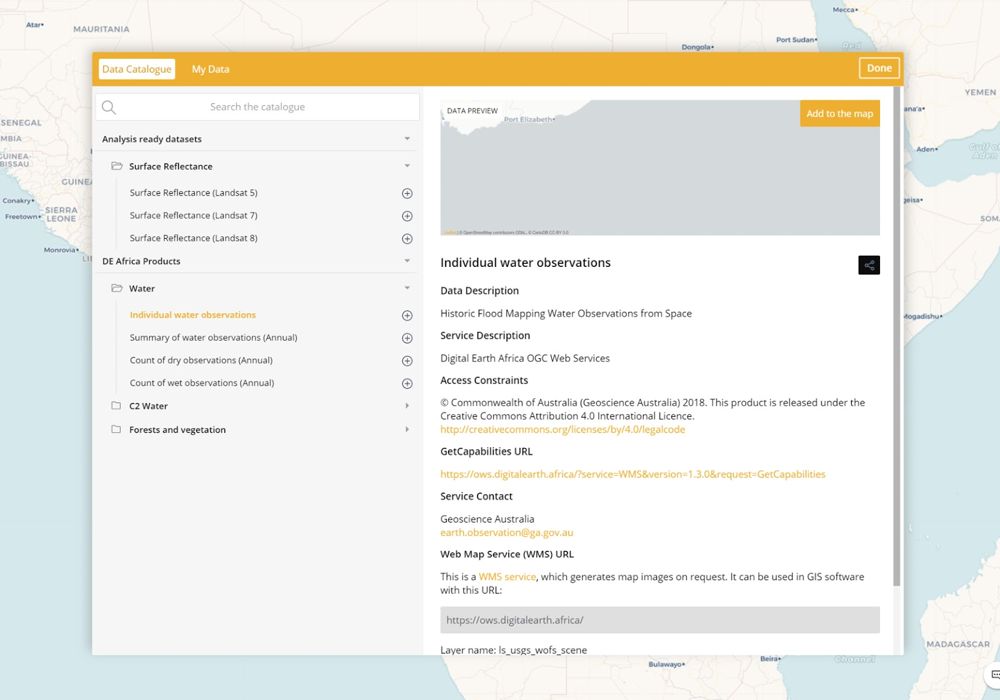
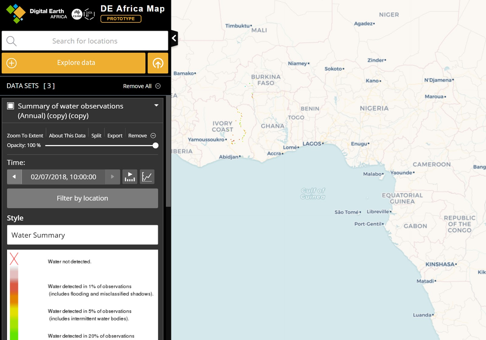
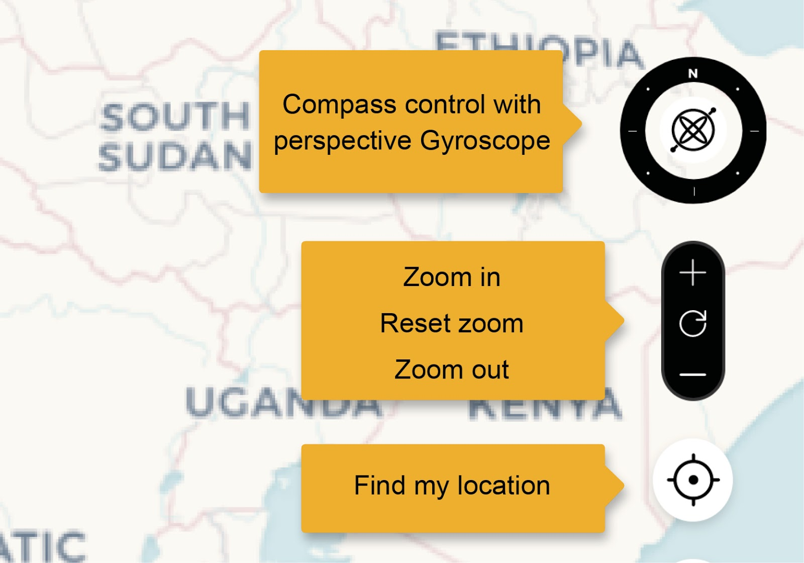
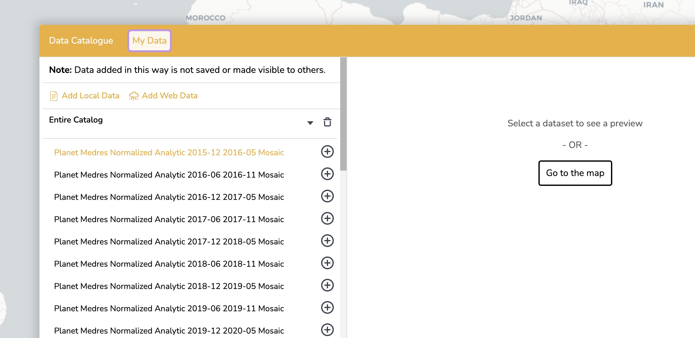

.. _deaafrica_map:

DE Africa Map
=============

This guide provides detailed instructions on how to use the different
features of the `Digital Earth Africa
Map <https://maps.digitalearth.africa/>`__.

Get Started
-----------

To launch the DE Africa Map and display some basic data follow these
steps.

-  Launch the DE Africa Map at
   `maps.digitalearth.africa <https://maps.digitalearth.africa/>`__.
-  In the left panel click the **Add Data** button to open the data
   catalogue (see image below).
-  Find a dataset of interest such as water.
-  Select the dataset to see a preview of that data and description.
-  To view your selected dataset on the map, click the **Add to the
   map** button.

Visualise and analyse your dataset:

-  The spatial data will be displayed in the map view, and a visual
   legend will appear in the Data workbench, on the left side of the
   page.

-  It may not be immediately obvious where your selected spatial data
   has loaded on the map if it does not cover a large part of Africa. To
   locate loaded data on the map, go to the workbench, and select **Zoom
   to extent**.

-  The dataset should now be visible in the map view.

-  To add additional datasets to the map, repeat the above steps.

-  Zoom manually by moving your mouse pointer over the map and using
   your mouse wheel to zoom in or out further.

-  Click and drag the map to further show the region in which you are
   interested.

Explore the workbench
---------------------

When a dataset is added to the map via the data catalogue, a legend for
that dataset will appear in the workbench. From the workbench you can:

-  Set the order data is shown on the map. To do this, click the title
   of a dataset and drag it to a new position in your workbench.
-  Toggle the visibility of added datasets by selecting the checkbox
   opposite your preferred dataset title
-  Zoom to the geographical extent of an added dataset
-  Set the opacity of individual datasets
-  Remove datasets from the map. Note: they can be re-added via the
   data catalogue.

Navigate the Map
----------------

There are multiple ways to navigate DE Africa Map’s map view:

Zooming
~~~~~~~

Move your mouse pointer over the map and use the scroll wheel to zoom in
or out. The location at the centre of the map display is the centre of
the zooming. Right-click and drag upwards or downwards over the map to
zoom about the centre point. Select the zoom control to zoom in or out
quickly by a set amount.

Panning
~~~~~~~

Click anywhere on the map and drag it to the required location.

Rotate the map
~~~~~~~~~~~~~~

Use the compass control to rotate the map so North is no longer at the
top. Select the “gyroscope” in the centre of the compass control and
drag slowly to the left or right to rotate the map clockwise or
anti-clockwise respectively. The further you drag, the faster it
rotates. Release the mouse button when you reach the desired rotation.

Select the North Point or outer ring of the Compass Control and drag it
around to set the desired rotation directly.

Control + left-click and drag left or right over the map to rotate the
view about the centre.

Perspective view
~~~~~~~~~~~~~~~~

Select the “gyroscope” in the centre of the compass control and drag
slowly upwards to tilt the view into a perspective view. Drag downwards
to tilt the view back to vertical. The further you drag, the faster it
tilts. Release the mouse button when you reach the desired view.

Control + left-click and drag upwards or downwards over the map to enter
or adjust the perspective view.

When you are in perspective view, control + left-click and drag left or
right over the map to “orbit” around the centre of the view. You can
also click and drag left or right over the “gyroscope” at the centre of
the Compass Control to orbit about the centre of the view.

Double-click the “gyroscope” in the centre of the Compass Control to
return the view quickly to a vertical view with North to the top at the
current location and scale.

Dragging to pan and using the mouse wheel to zoom still work while
showing a perspective view.

Use the splitter functionality
~~~~~~~~~~~~~~~~~~~~~~~~~~~~~~

The splitter functionality allows you to compare a dataset for different
time periods. To use it:

-  Select an area/location
-  Select a dataset from the catalogue to add it to the workbench
-  Select the **Split** link in the workbench to create a copy of the
   data already selected. Note that you can use the splitter with two
   different datasets, not just with copies of the same data
-  Select different times (using the date picker) for the “left” and
   “right” sections of the screen
-  Use the back and forward arrows to explore imagery and select
   cloud-free views
-  Drag the splitter on the screen to observe the differences

This video shows an example of the splitter used over a map of
Australia, but the functionality is the same.

|Split functionality video|

.. |Split functionality video| image:: http://img.youtube.com/vi/H3htpdYAE7w/0.jpg
   :target: http://www.youtube.com/watch?v=H3htpdYAE7w

Upload Data to the Map
----------------------

There are two ways to load your data:

1. Drag your data file onto the DE Africa Map map view. The format of
   the data file will be auto-detected.
2. Select **Add Data** in the left panel. This will launch the data
   catalogue. Select the **My Data** tab at the top of the modal window
   and follow the provided instructions.

As for DE Africa Map datasets, you can select regions or points to see
the data available for that location. If the file is a CSV file, the
data from all columns will be shown in the feature information dialogue.

You can also use all of the features of the workbench on the data you
have loaded as well.

To share a view of your data with others, you must first publish it to
the web somewhere with a URL, and then load it from there.

DE Africa Map can display two kinds of spreadsheets:

1. Spreadsheets with a point location (latitude and longitude) for each
   row, expressed as two columns: lat and lon. These will be displayed
   as points (circles).
2. Spreadsheets where each row refers to a country using ISO 3166
   2-letter or 3-letter code. Columns must be named cnt2, iso2, cnt3 or
   iso3 according to the `CSV-geo-au
   standard <https://github.com/TerriaJS/nationalmap/wiki/csv-geo-au#country-boundaries>`__.
   These will be displayed as regions, highlighting the actual shape of
   each area.

Spreadsheets must be saved as CSV (comma-separated values).

Other standard spatial data types such as GeoJSON and KML are also
supported.

|Upload Location|

.. |Upload Location| image:: http://img.youtube.com/vi/XKP90TcBq6A/0.jpg
   :target: http://www.youtube.com/watch?v=XKP90TcBq6A

Integrating External Web Services
---------------------------------

The DE Africa platform is built on top of open standards and can
integrate with a range of external web services. Some examples of
external services are included on this page.

Norway’s International Climate and Forests Initiative Data program (NICFI)
~~~~~~~~~~~~~~~~~~~~~~~~~~~~~~~~~~~~~~~~~~~~~~~~~~~~~~~~~~~~~~~~~~~~~~~~~~

NICFI has arranged for non-commercial users to be able to access
high-resolution, analysis-ready mosaics over the world’s tropics. It’s
possible to integrate the visual layers into DE Africa’s Maps
application or to download the data to use in the DE Africa Sandbox. For
more information, see `Planet’s NICFI
page <https://www.planet.com/nicfi/>`__.

Steps to load NICFI visual layers in Maps
^^^^^^^^^^^^^^^^^^^^^^^^^^^^^^^^^^^^^^^^^

1. Sign up for the program on the `NICFI home
   page <https://www.planet.com/nicfi/#sign-up>`__
2. Once you have access, copy your ``API_KEY`` from your `“My
   Settings” <https://www.planet.com/account/#/user-settings>`__ page on
   the Planet website
3. Copy this URL, and add your ``API_KEY`` to the end:
   ``https://api.planet.com/basemaps/v1/mosaics/wmts?api_key=YOURKEYGOESHERE``
4. Go to `DE Africa Maps <https://maps.digitalearth.africa/>`__ and do
   the following:

   -  Click “Explore map data”
   -  Click “My Data”
   -  Click “Web Data”
   -  Paste the above URL into the “Step 2” section, and click “Add”

When you’ve added one of the mosaics, you can visualise it across Africa
in context with DE Africa data, such as the Sentinel-2 GeoMAD.
