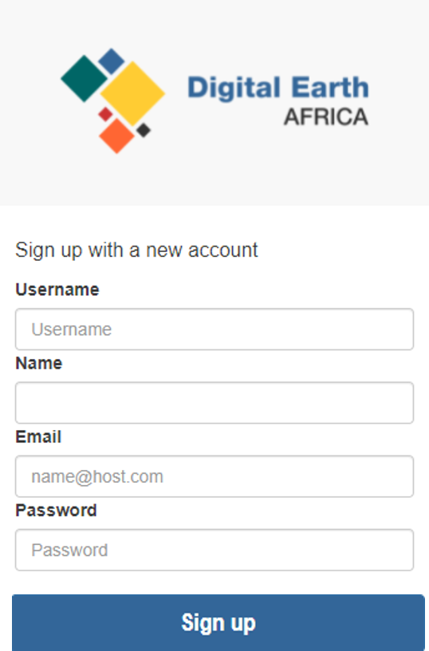
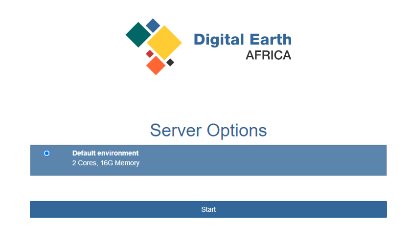
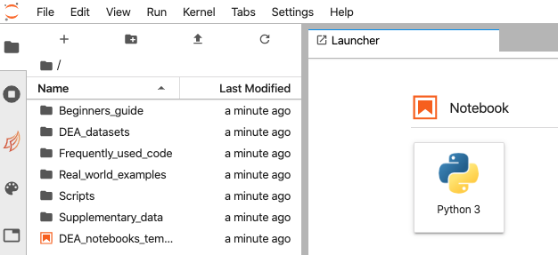

---------------
Getting Started
---------------

The Sandbox is free to use.
Visit `sandbox.digitalearth.africa <https://sandbox.digitalearth.africa/>`__ to
sign up for a new account, or sign in if you have an existing account.

Register
--------

1. Visit `sandbox.digitalearth.africa <https://sandbox.digitalearth.africa>`__ and click **Login or Sign up**.
2. Click **Sign up**.
3. Fill in the **Username**, **Name**, **Email** and **Password** fields. Passwords must be at least 8 characters, and contain at minimum a lower case letter, an upper case letter and a number. Record your username securely as it will be required to reset your password should you forget it.

4. Click **Sign up**.
5. A verification code will have been sent to your nominated email address. Enter the verification code and click **Confirm Account**. This will automatically log you in.

.. note::
    If you have not received the verification code email, please check your spam or junk mail folders.

Access
------

Sign in at: `sandbox.digitalearth.africa <https://sandbox.digitalearth.africa>`__

After signing in, you will be given a option of sandbox types to choose from:

  **Default:**  2 Cores, 16G Memory

You may see other options as well.
For regular users, the default environment should be enough for most of your needs.

Select **Default environment** and click **Start**.

The Sandbox will then prepare a JupyterLab environment for you; this can take
a few minutes.  You will automatically be redirected to the Sandbox environment.

The Sandbox runs completely in-browser and all necessary software is provided
as part of this environment, so no additional installation or configuration is required.

Navigate
--------

The JupyterLab interface consists of the main work area (right-hand panel), the
left sidebar (containing a file browser and other useful features), and a menu
bar along the top.

The main work area is where Jupyter notebooks will be displayed once opened. By
default, the Launcher is displayed, which allows you to open new files.

To open an existing Jupyter notebook, double-click through the folders to find a
notebook you're interested in, then double-click the notebook to
open it in the main work area. Notebooks are indicated by the ``.ipynb`` file
extension. The JupyterLab interface also supports plain text and Markdown files.

To learn more about JupyterLab, visit the `JupyterLab Documentation`_.

.. _JupyterLab Documentation: https://jupyterlab.readthedocs.io/en/stable/user/interface.html
